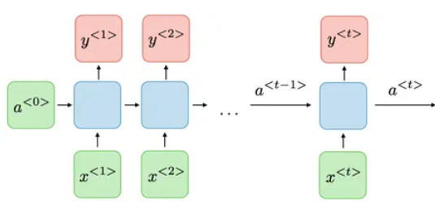

当然，以下是更加详细的循环神经网络（RNN）介绍文档：

# 循环神经网络（RNN）介绍

## 什么是循环神经网络？

循环神经网络（Recurrent Neural Network，RNN）是一种深度学习模型，专门设计用于处理序列数据，例如时间序列、自然语言、音频信号等。相较于传统的前馈神经网络，RNN 具备一种独特的结构，使得网络可以在处理序列数据时在不同时间步之间共享信息，从而更好地捕捉序列中的时间相关性和模式。

## RNN 的结构和工作原理

RNN 的核心思想是引入循环结构，使得网络在每个时间步都可以接收当前时间步的输入和上一个时间步的隐藏状态。这使得网络具有了一种记忆能力，可以将之前时间步的信息传递到后续时间步中。

RNN 的一个基本单元如下图所示：

在上图中，`Xt` 表示输入序列在时间步 t 的输入，`at` 表示在时间步 t 的隐藏状态，`Yt` 表示在时间步 t 的输出。RNN 在每个时间步都执行相同的操作，输入数据和上一个时间步的隐藏状态通过权重矩阵进行组合，并经过激活函数（通常为 tanh 或 sigmoid）得到新的隐藏状态和输出。

然而，传统的 RNN 存在**梯度消失**和**梯度爆炸**等问题，导致在处理长序列时难以有效地传递信息。为了解决这个问题，产生了一些改进的 RNN 变体，如长短时记忆网络（LSTM）和门控循环单元（GRU），它们引入了门控机制，更好地捕捉序列中的长距离依赖。

## 应用领域

RNN 在许多领域都有广泛的应用：

- **自然语言处理（NLP）**：RNN 可以用于文本生成、语言建模、机器翻译、文本分类和情感分析等任务。
- **语音识别**：RNN 可以处理音频数据，用于语音识别、语音合成等。
- **时间序列预测**：RNN 被应用于股票价格预测、天气预测、交通流量预测等。
- **图像描述生成**：结合卷积神经网络（CNN），RNN 可以生成图像描述。
- **视频分析**：RNN 可用于动作识别、视频标注等。

## 实现工具与库

许多深度学习框架提供了对 RNN 及其变体的支持，包括 TensorFlow、PyTorch、Keras 等。这些框架提供了高级的接口，帮助您构建、训练和部署 RNN 模型。使用 GPU 可以加速训练过程。

## 总结

循环神经网络是一种强大的神经网络模型，专门用于处理序列数据。通过引入循环结构和记忆机制，RNN 可以在序列数据中捕捉时间相关性，使其在多个应用领域都取得了卓越的成果。尽管传统的 RNN 存在一些问题，但通过改进的变体如 LSTM 和 GRU，我们能够更好地解决长序列的依赖关系。

如需进一步了解如何使用 RNN，您可以查看相关的教程和实际代码示例。

---

这份介绍文档提供了更详细的关于循环神经网络的解释，涵盖了基本原理、应用领域、工作原理和实现工具等方面的内容。您可以根据您的需要进行修改，以便更好地适应您的项目或学习需求。